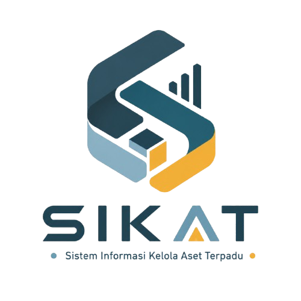

<p align="center">
  
</p>

<h1 align="center">SIKAT</h1>

<p align="center">
  Sistem Informasi Kelola Aset Terpadu
</p>

---

## Tentang SIKAT

SIKAT (Sistem Informasi Kelola Aset Terpadu) adalah aplikasi berbasis Laravel yang dirancang untuk membantu pengelolaan aset kampus secara digital dan terintegrasi.

Sistem ini menyediakan berbagai fitur untuk mendukung inventarisasi aset, pelacakan lokasi, pemeliharaan, pelaporan, dan monitoring aset secara real-time sehingga proses pengelolaan aset menjadi lebih efektif, efisien, dan transparan.

---

## Tim Pengembang

| Nama                      |
| ------------------------- |
| Elfrida Gyon Widad        |
| Ikrima Maisya Anwar       |
| Salsabila Zalyyatul Ummah |

---

## Fitur Utama

* Dashboard Monitoring Aset
* Manajemen Data Aset
* Manajemen Kategori Aset
* Upload Lampiran Aset
* Riwayat Pemeliharaan
* Pelacakan Lokasi Aset
* Laporan Aset
* Manajemen Pengguna
* Role Based Access Control (RBAC)

---

## Teknologi yang Digunakan

* Laravel 12
* PHP 8.2+
* MySQL
* Tailwind CSS
* Vite
* JavaScript

---

## Persyaratan Sistem

Pastikan perangkat Anda telah terinstal:

* PHP 8.2 atau lebih baru
* Composer
* Node.js dan NPM
* MySQL
* Git

---

## Cara Fork Repository

1. Buka repository GitHub.
2. Klik tombol **Fork** pada pojok kanan atas.
3. Pilih akun GitHub Anda.
4. Tunggu hingga proses fork selesai.
5. Repository akan tersalin ke akun GitHub Anda.

---

## Cara Clone Repository

```bash
git clone https://github.com/elfridagyn/sikat-pmpl.git
```

Masuk ke folder project:

```bash
cd sikat-pmpl
```

---

## Instalasi Project

### 1. Install Dependency PHP

```bash
composer install
```

### 2. Install Dependency Frontend

```bash
npm install
```

### 3. Salin File Environment

```bash
cp .env.example .env
```

### 4. Generate Application Key

```bash
php artisan key:generate
```

---

## Konfigurasi Database

Buat database baru:

```sql
CREATE DATABASE sikat_pmpl;
```

Kemudian sesuaikan file `.env`:

```env
DB_CONNECTION=mysql
DB_HOST=127.0.0.1
DB_PORT=3306
DB_DATABASE=sikat_pmpl
DB_USERNAME=root
DB_PASSWORD=
```

---

## Menjalankan Migrasi

```bash
php artisan migrate
```

Jika menggunakan data awal:

```bash
php artisan db:seed
```

Atau:

```bash
php artisan migrate:fresh --seed
```

---

## Menjalankan Aplikasi

Jalankan Laravel:

```bash
php artisan serve
```

Jalankan Vite:

```bash
npm run dev
```

Akses aplikasi melalui browser:

```text
http://127.0.0.1:8000
```

---

## 📂 Struktur Folder

```text
app/
├── Models
├── Http/
│   └── Controllers/

resources/
├── views/
├── css/
└── js/

database/
├── migrations/
└── seeders/

routes/
└── web.php
```

---

## 🔧 Troubleshooting

Membersihkan cache Laravel:

```bash
php artisan optimize:clear
```

Membersihkan konfigurasi:

```bash
php artisan config:clear
php artisan cache:clear
```

---

## Lisensi

Proyek ini dikembangkan untuk memenuhi kebutuhan akademik pada mata kuliah Pengembangan dan Manajemen Perangkat Lunak (PMPL).

© 2026 SIKAT - Sistem Informasi Kelola Aset Terpadu
